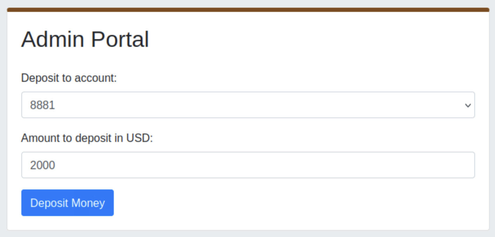

# Room: Offensive Security Intro

**Platform:** *TryHackMe*
**Category:** *Web*
**Difficulty:** *Easy*
**Goal:** *Hacking my first website!*

---

## TL;DR / Summary

This initial room in the Cyber Security 101 path introduced the fundamentals of offensive security and demonstrated the structure of TryHackMe exercises. As a practical challenge, I performed my first web exploitation on a simulated banking site.

---

## Environment

* Target URL: `http://fakebank.thm`
* Tools used: `dirb`
* Duration: `10 min`

---

## Exploitation

Thanks to TryHackMe's built‑in VM emulator, launching the vulnerable machine is as simple as clicking Start Machine on the room page. Once the machine is running, the lab directs us to the fake bank web application at `http://fakebank.thm`. The first task requires us to identify the bank account number displayed on the site (this serves as an initial proof-of-foothold).

After locating the account number, the practical part of the exercise begins. TryHackMe emphasizes that one of the easiest ways to find weaknesses in applications is to discover hidden functionality — for example, undisclosed URLs that expose administrative or privileged operations. These secret endpoints often allow standard users to perform actions they should not be able to.

To discover hidden URLs we use a directory brute‑force tool, `dirb`, which tests common page names from a wordlist against the target URL. Example command and output:

```bash
~/Desktop$ dirb http://fakebank.thm 

-----------------
DIRB v2.22    
By The Dark Raver
-----------------

START_TIME: Mon Nov 03 16:29:52 2025
URL_BASE: http://fakebank.thm/
WORDLIST_FILES: /usr/share/dirb/wordlists/common.txt

-----------------

GENERATED WORDS: 4610                                                          

---- Scanning URL: http://fakebank.thm/ ----
+ http://fakebank.thm/bank-deposit (CODE:200|SIZE:4663)                        
+ http://fakebank.thm/images (CODE:301|SIZE:179)                               
                                                                               
-----------------
END_TIME: Mon Nov 03 16:29:59 2025
DOWNLOADED: 4610 - FOUND: 2
```

The output shows which wordlist `dirb` used (`WORDLIST_FILES`) — this file contains typical directory and filename candidates that `dirb` iterates through. Results prefixed with `+` are discovered paths. In this case, `/bank-deposit` is revealed as a `200 OK` resource.

Visiting the discovered `/bank-deposit` endpoint leads to an administrative deposit portal where we can manipulate account balances. After using the portal, we can refill the target account and confirm the exploit’s effect.

While accessing the first address given, we arrive on the admin portal for deposits and we can re-fill our bank account :



At this point the lab objective is complete: we successfully discovered a hidden admin page and used it to manipulate the fake bank — a concise, instructive demonstration of how directory enumeration and exposed endpoints can lead to significant impact.

> **Note** : All interactions in this exercise were performed using the lab's web interface (browser). No additional tooling such as curl, Burp Suite, or custom scripts was used to complete the task.

---

## Conclusion

This room provided a concise, beginner-friendly introduction to offensive security. The lab guided me through the full process of exploiting a simulated web application, starting from reconnaissance to successfully manipulating a hidden administrative endpoint. The structured environment made it easy to understand the typical workflow in offensive security labs: launching a target VM, enumerating accessible resources, identifying hidden functionality, and performing controlled exploitation in a safe, legal environment.

While completing the main objective, I explored the VM filesystem in search of any additional hints or easter eggs. TryHackMe suggested examining the `common.txt` wordlist directly on the machine (`/usr/share/dirb/wordlists/common.txt`). I reviewed the file, but found no further surprises beyond the intended lab content. This reinforced the lesson that, in real-world assessments, systematic enumeration and verification of accessible resources are key steps, while many “hidden” items may simply be noise or instructional scaffolding.

---

#### Key Takeaways
- [x] Directory enumeration is a high-value technique for web assessments; even a brief scan can reveal hidden administrative endpoints.
- [x] Exposed or undocumented URLs can lead to significant security impact, highlighting the importance of checking for unauthorized functionality.
- [x] The lab demonstrated the value of safe, hands-on practice in a controlled environment to understand offensive security fundamentals.