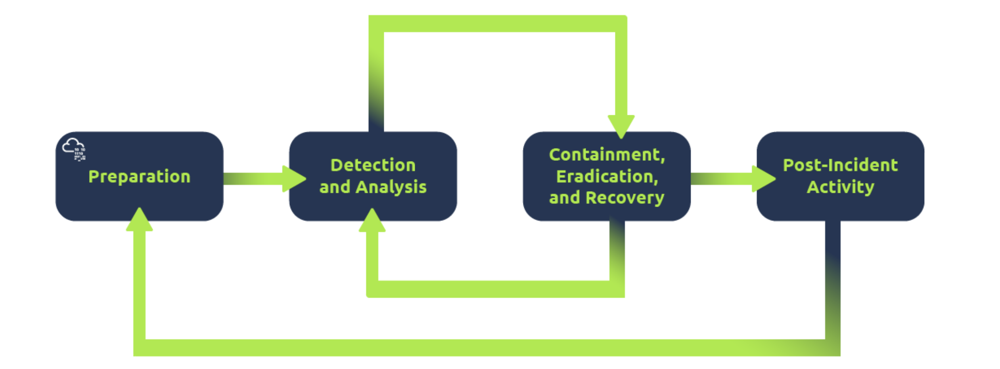
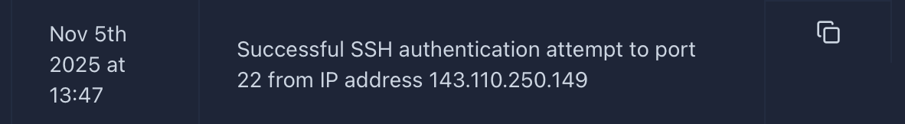
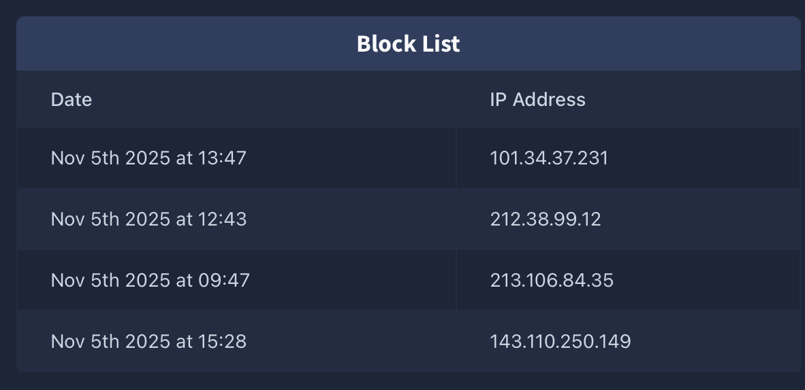

# Room: Defensive Security Intro

**Platform:** TryHackMe
**Category:** Learn
**Difficulty:** Easy
**Goal:** Introducing defensive security

---

## TL;DR

This room gives us a wide explanation of what is a cyber security threat and how organisations usually handle them.

---

## 1) Context

* This room is there to uncover how the defensive security teams (also known as **blue teams**) prepare and proactively protect organisation's IT infrastructures.
* The two main tasks of a blue team are to ***prevent intrusions from occuring*** and to ***detect intrusions when they occur*** to be able to respond properly.

---

## 2) Step-by-step walkthrough

The *first stage* is to read a post that introduce defensive cyber-security. They specify many tasks a blue team can be involved in:
- **Cyber-security awarness**: providing user education on cyber threats (such as phishing and social engineering).
- **Documenting & Managing Assets**: maintaining documentation about the organisation's systems is crucial to adequately protect them.
- **Preventative Security**: focuses on stopping attacks before they happen. Technologies such as firewalls and intrusion prevention systems act as gatekeepers, allowing legitimate traffic while blocking potentially harmful activity.
- **Logging & Monitoring**: keeping a logical and comprehensive logging of the infrastructures network and the system activity is essential to detect threats or unhautorized activities.
- **Frameworks, Policies & Procedures**: Implementing clear security policies promotes appropriate and secure usage of company systems and devices.

The *second stage* let us explore the variety of areas within defensive security that work together. That task especially focuses about the **Security Operation Center** (SOC). The SOC is a team that monitors the network and its systems to detect malicious events. Main areas of interest for a SOC are :
- **Trends & Vulnerability Awareness**: beeing up to date with the latest trends and vulnerabilities is necessary to help understand the risks an organisation can face.
- **Policy Violations**: Occur when users or systems do *not* follow the organization’s *security policies*, which define how devices, data, and resources should be safely used. The SOC detects these violations and takes steps to correct or mitigate them.
- **Unauthorised & Illegal Activity**: A baseline of acceptable behavior and operations is established by the SOC. Deviations from this baseline are thoroughly investigated, since unlawful or unsafe actions elevate the organization’s overall risk exposure.
- **Intrusion & Breach Detection**: Any organiation, no matter how well protected it is, can contain breaches. The role of the SOC team is to detect and handle them as soon as possible.

The *third stage* talks about digital forensic. This is the process of identifying, preserving, analizing and presenting data from computers, networks, mobile devices or other digital services in a way that is legally admissible and accurate. This involve looking information from:
- **File System**: when analizing a low-level copy of a system's storage, we can get much informations such as installed programs, created, partially overwritten and deleted files.
- **System Memory**: Some malicious attacks use programs that only run on the RAM, analyzing the file system *only* will fail. So examining the *system memory* is needed to uncover detail about how that malicicous program operates.
- **System Logs**: records generated by an operating system or applications that track events on a specific device, such as user logins, process execution, file access, and system errors. They may be stored locally or sent to centralized logging servers or SIEM (Security Information and Event Management) systems.
- **Network Logs**: records captured by network devices or monitoring systems that track traffic between devices, including source/destination IPs, ports, protocols, and alerts from firewalls or IDS/IPS. These logs are often stored centrally to detect suspicious activity across the network.
> **Note**: Both types of logs are generally designed to be immutable and may exist in multiple locations, so even if an attacker attempts to erase traces, some evidence usually remains.

The *fourth stage* teaches us what's the **Incident Response**. This is how organisations manage security events in order to minimise damage, contain the threat and recover fast. They give us a shceme to understand **Incident Response** flow :

- **Preparation**: this step involves establishing the resources, processes, and framework necessary to effectively handle security incidents. It includes forming an incident response team, setting up supporting infrastructure, and implementing preventive measures such as phishing awareness training.
- **Detection & Analysis**: detecting incidents involves applying both automated tools and defined procedures to uncover malicious activity, determine its reach, and assess its severity. Log analysis plays a key role in spotting suspicious events.
- **Containement, Eradication and Recovery**: limiting as mush as possible the impact of the incident. This can be : preventing the virus from spreading to other devices, eliminating the cause, restauring affected systems, etc.
- **Post-Incident Activity**: look back at the incident to see how it was handled, how it could have been prevented, and what was learned. Consider whether more cybersecurity training for staff is necessary.

The *last stage* is a practical example of defensive security. We should act as a SOC analist of an organisation with access to the organisation's internal SIEM tool. **TryHackMe** prepared a simplified version of a SIEM system to provide a hands-on simulation.
While opening the SIEM simulation, we have to follow many steps. First we have to find a malicious IP then scan it. We can directly see those two alerts:

Those are critical alerts. We can see the device from ip *143.110.250.149* attempted to connect without authorization then successfuly authenticate some minutes later. We can move to the next window that allow us to scan an ip and here is the result:

The scanner confirmed the ip is malicious. Then we are asked to escalate the event to a pole able to handle the issue. I choose Will the SOC team lead. He gives us the permission to block that malicious ip. Now we just have to add that ip to the block list to finish the simulation. You can see the malicious ip adress at the bottom of the block list:

---

## 3) Conclusion

Through this room, I gained a comprehensive understanding of the different types of threats that organizations commonly face — from *social engineering* and *phishing* to *insider risks* and *technical exploits*. I also learned how cybersecurity frameworks, such as SOCs, policies, and incident response plans, are structured to detect, contain, and mitigate these threats effectively.
The simulation provided a realistic perspective on how security incidents unfold in practice. It emphasized not only the technical aspects of detection and response but also the critical importance of communication, coordination, and teamwork between different members of the security team. 
Overall, this experience reinforced the importance of preparation, continuous monitoring, and post-incident analysis in maintaining an organization’s resilience against cyber threats.
