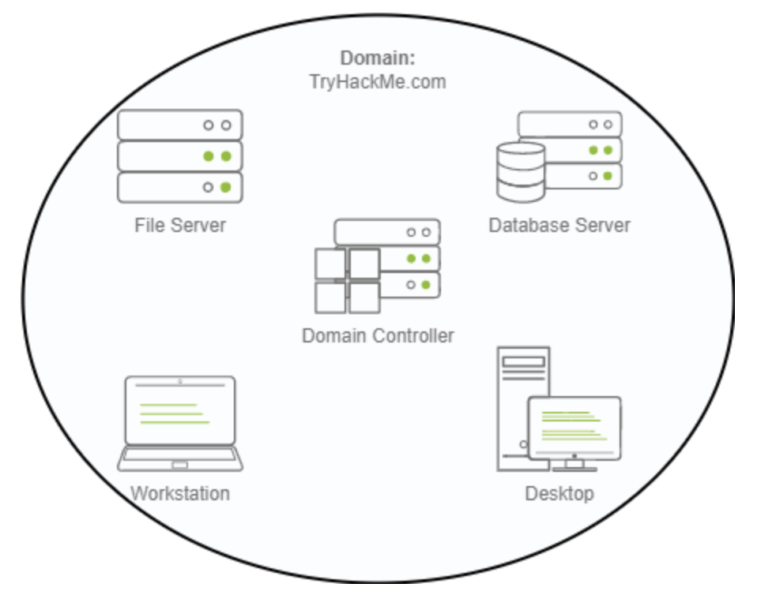
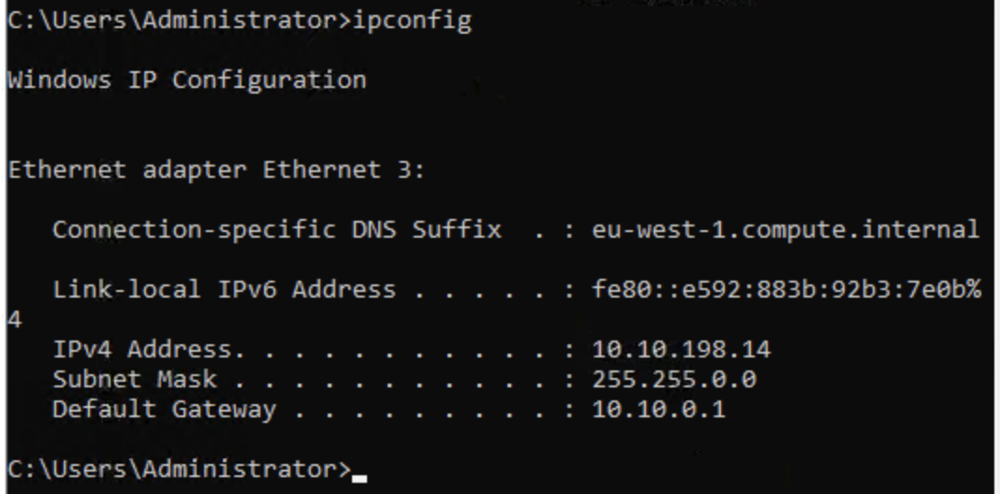
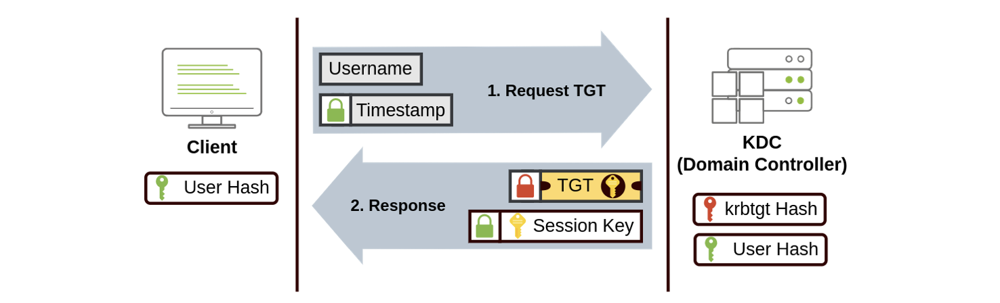
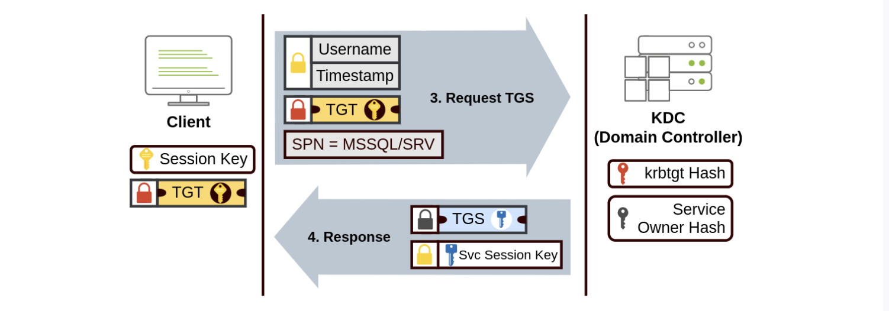
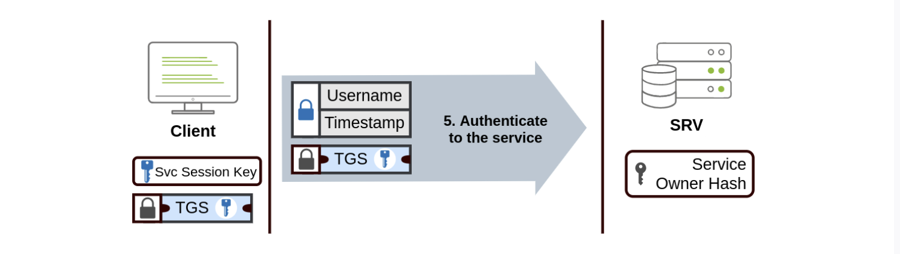
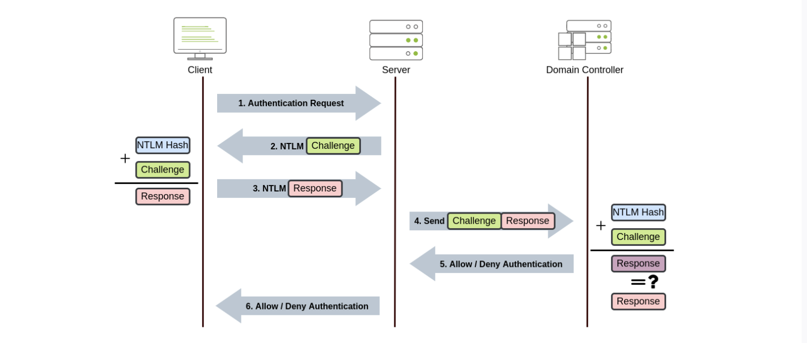

# Room: Active Directory Basics

**Platform:** TryHackMe
**Category:** Learn
**Difficulty:** Easy
**Estimated time:** `90 min`
**Objective(s):** This room will introduce the basic concepts and functionality provided by Active Directory.

---

## TL;DR

Active Directory (AD) centralizes authentication and resource management in Windows environments. It organizes users, computers, and policies into domains, OUs, and groups, enforced by Domain Controllers. Kerberos handles modern authentication, and multi-domain setups (trees & forests) use trust relationships to share access securely.

---

## 1) Windows Domains

In this first stage, I learned why a **Windows domain** is useful for managing multiple computers and users efficiently. Instead of configuring each machine individually, a domain centralises administration using **Active Directory (AD)** on a **Domain Controller (DC)**.



Key benefits include:
- **Centralised identity management**: Users can log in to any machine in the domain using a single set of credentials.  
- **Security policy enforcement**: Policies can be applied across all computers from AD.
- **Simplified administration**: Tasks like account creation, permissions, and updates are easier to manage for large networks.

For the lab, I accessed the preconfigured `THM.local` Domain Controller using the given credentials (via browser VM or RDP) to explore the domain and prepare for additional configuration tasks. 

This stage highlights how domains scale administration and security compared to manually managing individual machines.


## 2) Active Directory

In this stage, I learned that the **core of a Windows Domain** is the **Active Directory Domain Service (AD DS)**, which acts as a central directory holding all the information about objects in the network. Objects include **users, machines, groups, printers, shares**, and more.  

### Users
- Users are **security principals**, meaning they can authenticate in the domain and be assigned permissions to network resources.  
- Users can represent:
  - **People**: employees needing access
  - **Services**: accounts for services like IIS or SQL Server  
- Service accounts have limited privileges, only enough to run their respective services.  

### Machines
- Each computer joining the domain gets a **machine account**, also a security principal, with limited domain rights.  
- Machine accounts are **local administrators** on their own machine and have auto-rotating passwords (120 characters).  
- Machine account naming convention: `ComputerName$` (e.g., DC01 → DC01$).  

### Security Groups
- Groups allow permissions to be assigned collectively instead of to individual users.  
- Groups can include users, machines, and even other groups.  
- Common default security groups include:
  - **Domain Admins**: full domain admin privileges
  - **Server Operators**: manage DCs, limited group modification rights
  - **Backup Operators**: bypass permissions for backups
  - **Account Operators**: manage accounts
  - **Domain Users**: all users in the domain
  - **Domain Computers**: all computers
  - **Domain Controllers**: all DCs  

### Active Directory Users and Computers (ADUC)
- Used to manage **users, machines, and groups** in AD.
- Objects are organized into **Organizational Units (OUs)** for easier policy management.
- Example: THM OU has child OUs for IT, Management, Marketing, R&D, and Sales.
- OUs can mimic a business structure for efficient policy deployment.
- Tasks in ADUC include creating/deleting users, modifying accounts, resetting passwords, and managing machines.

### Default AD Containers
- **Builtin**: default groups
- **Computers**: all joined machines
- **Domain Controllers**: all DCs
- **Users**: default users and groups
- **Managed Service Accounts**: service-specific accounts

### OUs vs Security Groups
- **OUs**: used to apply policies/configurations to sets of users or computers (1 OU per user).
- **Security Groups**: used to grant access to resources; a user can belong to multiple groups.

This stage highlights how **AD DS organizes and manages users, computers, and groups**, providing both policy control (via OUs) and resource access management (via security groups) in a scalable enterprise environment.


## 3) Managing Users in AD

I inspected the Active Directory OUs and users to align AD with the new organisational chart below:

I directly see that there currently is five departments in `thm.local > THM`.
I removed the extra department `Research and Developpement` OU that was closed (had to enable **View > Advanced Features** first to disable the OU's "Protect against accidental deletion" option), then deleted the OU and its child objects.

I compared users in each department with the chart and removed `Christine` and `Robert` accounts from `Sales` as they didn't appear in the given organisation.

I then delegated routine administrative rights to a support user: delegation lets non-admins perform specific tasks on an OU. For the Sales OU I delegated **Reset user passwords** to `phillip` via **Delegate Control > Add user > select the Reset password task**.

There I encountered my first issue. The guide told me to connect onto phillip account via RDP but I had to specify the target's IP, which I didn't know.

As the purpose of the AD DS is to enable anybody to connect to any mahcine, I'll just give the current machine IP. To get that, i opened the terminal and ran `ipconfig`.


I tried to RDP with that IP (IPv4 Address) and this led me to the connection page where i could enter phillip's credentials.


Then I used PowerShell to reset Sophie’s password and force a change at next logon:

```powershell
# As phillip
Set-ADAccountPassword sophie -Reset -NewPassword (Read-Host -AsSecureString -Prompt 'New Password') -Verbose
Set-ADUser -ChangePasswordAtLogon $true -Identity sophie -Verbose
```

Finally, I logged in as `THM\sophie` with the new password (RDP) to confirm the reset and retrieve the assigned flag from Sophie’s desktop.


Overall, the stage showed how to safely remove OUs, keep AD organised, and delegate limited admin tasks without granting full Domain Admin rights.

##  4) Managing Computers in AD

By default, every new device that joins a domain (except Domain Controllers) is placed under the **Computers** container.
While convenient, this default setup quickly becomes messy — servers, workstations, and other devices end up mixed together, making it hard to apply targeted policies.

To improve organisation and management, I restructured the AD by separating devices into two dedicated **Organizational Units (OUs)**:

- **Workstations OU** → for end-user computers and laptops used by staff
- **Servers OU** → for infrastructure and application servers
> (Note: Domain Controllers already have their own OU by default)

This OU separation provides several benefits:
- Enables different **Group Policy Objects (GPOs)** for servers vs. user devices
- Reduces security risks by keeping privileged systems isolated
- Makes AD management cleaner and more scalable

After creating the OUs directly under **thm.local**, I moved:
- All **personal computers and laptops** to the **Workstations OU**  
- All **servers** to the **Servers OU**


This logical separation sets the foundation for applying role-specific security and configuration policies later in the environment.

## 5) Group Policies

After organising our **users** and **computers** into dedicated **Organizational Units (OUs)**, the next step was to apply distinct configurations and security policies to each.  
This is achieved through **Group Policy Objects (GPOs)** — collections of settings that can target either users or computers and be linked to specific OUs.

### Understanding GPOs

- **Purpose:** Centrally manage configurations and security baselines across the domain.
- **Scope:** A GPO applies to the OU it’s linked to **and all its sub-OUs**.
- **Filtering:** Security filtering can restrict GPOs to specific users or computers.
- **Distribution:** Policies are synced through the **SYSVOL share** on Domain Controllers and automatically refreshed every ~2 hours (or manually with `gpupdate /force`).


### Existing GPOs in the Domain

The preconfigured domain already included:
- **Default Domain Policy** — applies password and lockout settings across the entire domain.
- **RDP Policy** — linked at the domain level.
- **Default Domain Controllers Policy** — applies only to Domain Controllers.

We modified the **Default Domain Policy** to enforce a **minimum password length of 10 characters**, strengthening the overall authentication policy.

### Creating New GPOs for THM Inc.

As part of our administrative tasks, we created and deployed two new policies:

#### 1. Restrict Control Panel Access
- **Goal:** Prevent non-IT users from modifying system settings.
- **Policy Used:**
  `User Configuration → Administrative Templates → Control Panel → Prohibit Access to Control Panel and PC settings`
- **GPO Name:** `Restrict Control Panel Access`
- **Linked To:**
  - Marketing OU
  - Management OU
  - Sales OU
  *(IT users retain full access.)*

> **Result:** When logging in as a Marketing, Sales, or Management user (e.g., Mark), attempting to open the Control Panel shows an “Access Denied” message.

#### 2. Auto Lock Screen
- **Goal:** Automatically lock workstations and servers after 5 minutes of inactivity.
- **Policy Used:**
  `Computer Configuration → Administrative Templates → Control Panel → Personalization → Screen Saver Timeout`
- **GPO Name:** `Auto Lock Screen`
- **Linked To:** Root domain (**thm.local**)  
  *(Applies to all computers — Workstations, Servers, Domain Controllers.)*

> **Result:** All machines lock automatically after 5 minutes of user inactivity.

### Verification

- Logged in as **Mark (THM\Mark)** — confirmed Control Panel access was restricted.  
- Waited 5 minutes to observe auto screen lock activation.  
- Ran `gpupdate /force` where necessary to apply changes immediately.

## 6) Authentication Methods

In Windows domains, **all authentication credentials** are stored in the **Domain Controllers (DCs)**.
Whenever a user attempts to log in or access a resource, the **Domain Controller** verifies their credentials.
Two main authentication protocols handle this process:

- **Kerberos** (default for modern Windows environments)
- **NetNTLM** (legacy protocol for backward compatibility)

While **Kerberos** is the preferred and more secure method, **NetNTLM** often remains active for compatibility with older systems.

### Kerberos Authentication

Kerberos uses a **ticket-based** authentication mechanism to avoid sending passwords across the network.  
Once a user authenticates, they receive **tickets** that serve as proof of identity for future requests.

#### Process Summary

1. **Initial Authentication (TGT Request):**  
   - The user sends their username and a timestamp encrypted with a key derived from their password to the **Key Distribution Center (KDC)** on the Domain Controller.  
   - The KDC responds with a **Ticket Granting Ticket (TGT)** and a **Session Key**.  
   - The **TGT** is encrypted with the **krbtgt** account’s password hash, preventing tampering.


2. **Service Ticket Request (TGS Request):**  
   - When accessing a network service (e.g., file share, web app, database), the user sends the TGT, a timestamp (encrypted with the Session Key), and the **Service Principal Name (SPN)** to the KDC.  
   - The KDC issues a **Ticket Granting Service (TGS)** ticket and a **Service Session Key**.  
   - The **TGS** is encrypted using the **Service Owner’s** password hash.


3. **Service Access:**  
   - The user presents the **TGS** to the target service.  
   - The service decrypts the TGS using its account’s password hash and validates the **Service Session Key**.  
   - Once verified, the user is authenticated and allowed access.



This system ensures that **passwords are never transmitted** over the network and authentication is **fast and secure** thanks to ticket reuse.

### NetNTLM Authentication

**NetNTLM** relies on a **challenge-response** mechanism rather than tickets. It’s an older protocol that predates Kerberos.



1. The **client** requests authentication from the **server**.
2. The **server** generates a random **challenge** and sends it to the client.
3. The **client** uses their **NTLM password hash** and the challenge to compute a **response**.
4. The **server** forwards both the challenge and the response to the **Domain Controller**.
5. The **DC** recomputes the response using the stored password hash.
6. If both responses match, authentication succeeds; otherwise, it fails.
7. The **server** relays the result back to the client.

> **Note:** The user’s password or hash is never transmitted directly.
> For **local accounts**, the verification occurs locally via the **Security Account Manager (SAM)**, without involving the DC.


### Summary

| Protocol    | Mechanism            | Modern Status          | Password Sent? | Security Level |
|-------------|----------------------|------------------------|----------------|----------------|
| **Kerberos**| Ticket-based         | Default / Modern       |  No            | High           |
| **NetNTLM** | Challenge-response   | Legacy / Compatibility |  No            | Moderate       |

## 6) Tree, Forest and Trust

### Single Domain

A **single domain** setup is ideal for small or growing companies.  
It contains one set of **users, computers, and servers** managed by a **Domain Controller (DC)**.  
However, as a company expands—geographically or structurally—managing everything under one domain becomes difficult.

---

### Trees

When an organization grows (e.g., opens a branch in another country), it may need to:

- Apply **different Group Policies (GPOs)** due to local regulations.
- Allow **independent IT teams** to manage their own resources.
- Avoid overly complex **OU structures** that are hard to maintain.

#### What Is a Tree?

A **Tree** is a group of domains that share the same **namespace**.  
Each domain has its **own AD database, users, and policies**, but they’re all linked together hierarchically.

Example:
```
Root domain: thm.local
	├── uk.thm.local
	└── us.thm.local
```

#### Benefits

- Each branch (UK, US) can manage its own users and servers.
- **UK Admins** can’t modify **US resources**, and vice versa.
- Policies are applied independently per domain.
- Simplifies **administration and delegation** of privileges.

#### New Security Role

- **Enterprise Admins** → Have admin rights across all domains in the enterprise.
- **Domain Admins** → Have admin rights within their own domain only.

### Forests

When multiple domain trees use **different namespaces**, they can be grouped into a **Forest**.

#### Example

If your company *THM Ltd* acquires *MHT Inc*, you might have:
```
THM Tree: thm.local
	└── uk.thm.local
MHT Tree: mht.com
	└── asia.mht.com
```


Both trees can coexist within a **single forest**, maintaining independence while allowing controlled interaction.

#### Key Point

A **forest** = multiple **trees** with different **namespaces** that share a common **global catalog** and trust framework.

### Trust Relationships

To enable collaboration across domains or forests, **trust relationships** define which users can access which resources.

#### Types of Trusts

- **One-Way Trust**
  - Domain A *trusts* Domain B → Users from B can access resources in A.
  - Example: `AAA → BBB` means users in BBB can access AAA’s resources.

- **Two-Way Trust**
  - Both domains trust each other → Mutual access possible.
  - Default relationship when domains are part of the same **tree** or **forest**.

#### Important Note

A trust relationship **only allows the possibility** of access - it doesn’t grant it automatically.
Admins must still define **permissions** for which users or groups can access specific resources.

#### Summary

| Concept | Description | Example |
|---|---|---|
| **Domain** | Core unit managing users, computers, and policies | thm.local |
| **Tree** | Multiple domains with the same namespace | uk.thm.local, us.thm.local |
| **Forest** | Multiple trees with different namespaces | thm.local + mht.com |
| **Trust Relationship** | Allows cross-domain access authorization | One-way or Two-way |

---

## Conclusion

The **Active Directory Basics** lab clarified how enterprise-scale Windows networks are structured and managed.
I learned how **AD centralizes authentication, organizes resources, and enforces policies** across users and machines through **Domains, OUs, Groups, and GPOs**. By separating users, computers, and policies logically, administrators gain precise control, stronger security, and simplified maintenance.
Understanding AD’s layered design - from Kerberos authentication to **domain trees and forests** - is fundamental for anyone managing or defending Windows infrastructures. This knowledge forms the backbone of both **system administration** and **Active Directory security** in real-world enterprise environments.

---

## Key Takeaways  

### Core Concepts  
- **Active Directory Domain Services (AD DS)** stores and manages all network objects.
- **Domain Controllers (DCs)** authenticate users and apply Group Policies.
- **Objects** include users, computers, and groups — each with defined permissions.

### Structure & Management  
- **Organizational Units (OUs)** group users/computers for targeted policies.
- **Groups** simplify permission management; OUs handle GPO application.
- **Delegation** allows assigning limited admin rights (e.g., password resets).

### Group Policies (GPOs)  
- Enforce rules like password complexity or screen lock timers.
- Apply hierarchically through OUs and refresh automatically.
- Example GPOs: disable Control Panel, auto-lock after 5 minutes of inactivity.

### Authentication  
- **Kerberos** (default) uses ticket-based authentication — secure and efficient.
- **NetNTLM** (legacy) uses a challenge-response mechanism — retained for compatibility.

### Domain Architecture  
- **Domain** → Single administrative boundary.
- **Tree** → Multiple domains sharing a namespace (e.g., `uk.thm.local`).
- **Forest** → Multiple trees with different namespaces (e.g., `thm.local` + `mht.com`).
- **Trust relationships** enable cross-domain access (one-way or two-way).
- **Enterprise Admins** manage all domains; **Domain Admins** manage one.